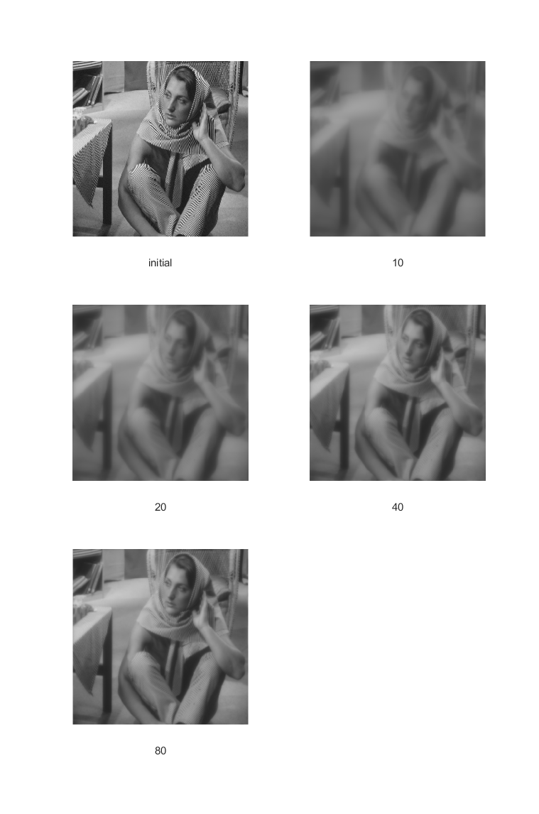
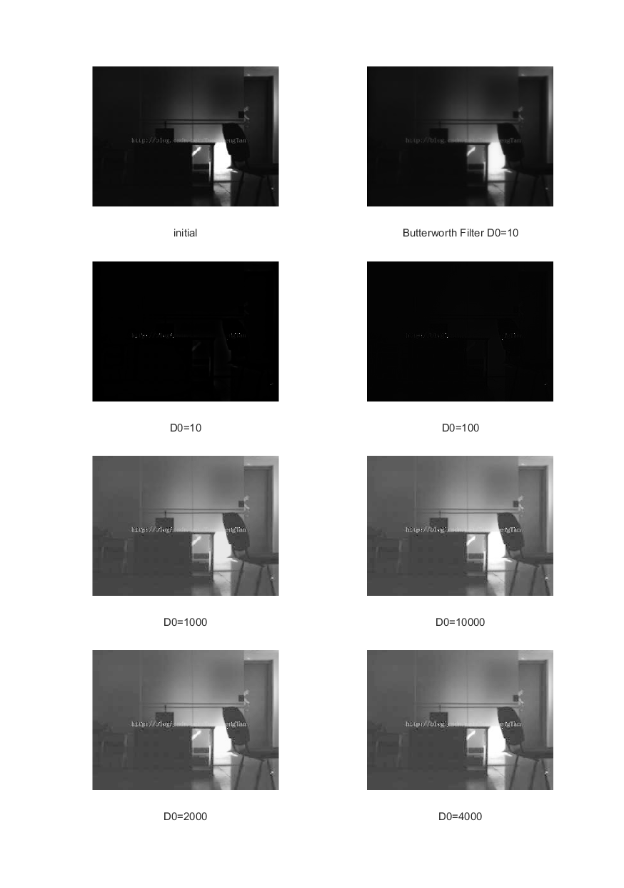

# Homework3
`jskyzero` `2017/11/26`

>1. 给定图像‘barb.png’，利用一阶Butterworth低通滤波器进行频域滤波，当
> D0 = 10,20,40,80 时，给出相应滤波图像，并分别以频域和空域的观点解释有关
>滤波结果。
>
>2. 采用同态滤波来增强图像‘office.jpg’细节
>（1）参数选择
>（2）自己尝试不同的 D0 以得到最好的结果。
>（3）如将滤波器替换为一阶Butterworth高通滤波器，比较滤波结果。

## Butterworth低通滤波器

由傅里叶变换的平移性质，通过对原图像乘以`(-1)^(x+y)`因子，我们将频域的坐标原点平移到了中央，此时在傅里叶变换后的图像中央是原图像的低频部分，我们的滤波器的D0决定了变换后图像中央保留部分的大小，D0越小，保留的区域越小，保留的高频信息就越少，因此我们可以看见图像变得模糊。对应到空域，频域下的滤波器越尖锐（D0小），空域下的滤波器大小越大（越模糊）。

## 同态滤波

更换不同D0后，经测试，D0必须要大到一定范围（测试中为1000-10000），滤波效果才会比较好，但是D0继续增大改善效果不再明显。

和一般的滤波器比较，同态滤波通过对数/指数转换，可以改善图像的光照，而一般的滤波器只能根据频率滤波。

