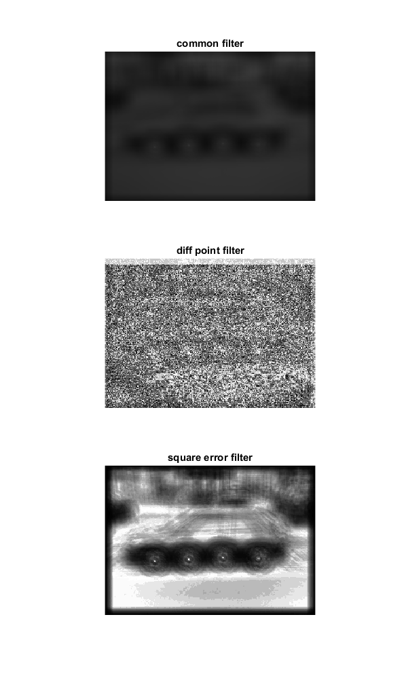
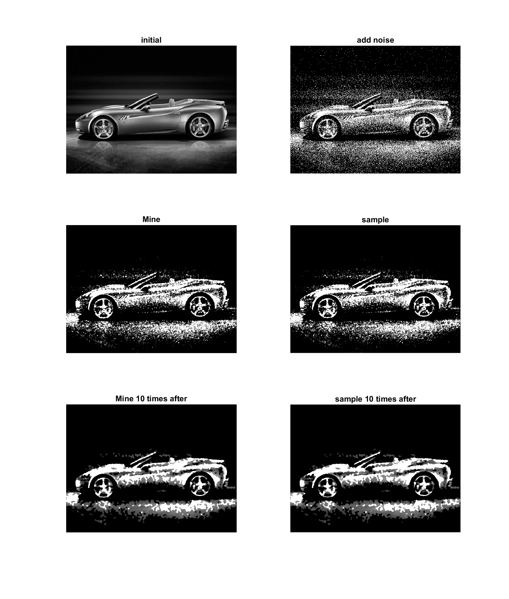

# Homework2
`jskyzero` `2017/10/22`

## 问题一
给定图像car.png和模版图像wheel.png，利用相关检测实现对car图像中的 wheel检测，具有最大相关值的位置可以解释为所检测到的wheel位置。程序的输 入是图像和模版，要求： 
（i）显示图像的相关值结果；
（ii）列出在图像中检测到的所有目标的（x，y）坐标。

可以参考[这篇文章](http://www.cs.umd.edu/~djacobs/CMSC426/Convolution.pdf)，这里面对相关和卷积做了详细的说明并且解释了相关性匹配。

本质上来说，我们要判断目标图像和原图的差异性，实验中采用了直接相关滤波，不同的像素个数，像素差值平方三种方法来判断，第一种显然是不够好的，当待匹配区域整体值偏高，就会导致结果出现错误。

输入的匹配图像如下(注：白色为匹配程度较高，同时为了使得结果较为明显，使用了直方图均衡。)



## 问题二

产生椒盐噪声图像，实现采用中值滤波，采用3X3窗口实现中值滤波，注：不能使用Matlab中的‘medfilt2’。显示原图像、椒盐噪声图像、中值滤波图像，并和采用Matlab‘medfilt2’ 的结果做比较。

实现起来并不难，这里把一些烦人的地方说一下，主要是如果一开始生成随机数就用整数型，那么假定只有一万个像素点，没有重复的概率是
```python
>>> (254 / 255) ** 10000
8.617114423659648e-18
```
我们的图像是比这个大的，没有再生成函数上下文章的话，想要快速产生的话不如就一开始用double。

比较最后结果的时候还试了一下多次的情况，私下看了下100次发现没什么变化，图上只测了10次。


